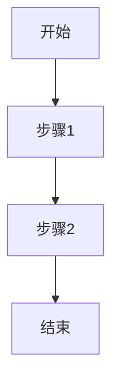

# Marp for VS Code 详细使用指南

## 目录
1. [简介](#简介)
2. [安装](#安装)
3. [基础使用](#基础使用)
4. [Marp Markdown 语法](#marp-markdown-语法)
5. [主题设置](#主题设置)
6. [页面设置](#页面设置)
7. [导出演示文稿](#导出演示文稿)
8. [图片处理](#图片处理)
9. [高级功能](#高级功能)
10. [常见问题与解决方案](#常见问题与解决方案)
11. [自定义与扩展](#自定义与扩展)
12. [参考资源](#参考资源)

## 简介

Marp (Markdown Presentation Ecosystem) 是一个基于 Markdown 语法的演示文稿创建工具。Marp for VS Code 是其在 Visual Studio Code 编辑器中的扩展实现，让您可以在编写 Markdown 的同时实时预览幻灯片效果，并提供多种格式的导出选项。

### 主要特点

- 使用 Markdown 语法快速创建演示文稿
- 实时预览功能
- 支持多种主题和样式
- 可导出为 PDF、PPTX、HTML 等格式
- 支持 CSS 自定义样式
- 支持图表、数学公式等多种内容形式
- 无需在线服务，完全本地化工作

## 安装

1. 打开 VS Code
2. 点击左侧扩展图标（或按 `Ctrl+Shift+X`）
3. 在搜索框中输入 "Marp for VS Code"
4. 点击 "安装" 按钮
5. 安装完成后重启 VS Code

或者通过 VS Code 市场直接安装：[Marp for VS Code](https://marketplace.visualstudio.com/items?itemName=marp-team.marp-vscode)

## 基础使用

### 创建新的演示文稿

1. 在 VS Code 中创建一个新的 `.md` 文件
2. 在文件开头添加 Marp 前置元数据：

```markdown
---
marp: true
---

# 我的第一个演示文稿

这是使用 Marp 创建的第一张幻灯片
```

### 开启预览

有三种方式可以预览您的演示文稿：

1. **编辑器内预览**：点击 VS Code 右上角的预览图标（分屏图标）
2. **独立预览窗口**：使用命令面板（`Ctrl+Shift+P`）执行 "Marp: Open Preview"
3. **自动预览**：在设置中启用 `markdown.marp.enableHtml` 和 `markdown.marp.breaks`，编辑文件时会自动更新预览

### 幻灯片分隔

使用 `---`（三个连字符）在新行中来分隔幻灯片：

```markdown
---
marp: true
---

# 第一张幻灯片

内容...

---

# 第二张幻灯片

更多内容...
```

## Marp Markdown 语法

### 基本语法

Marp 支持所有标准 Markdown 语法，如：

- `# 标题`（一级标题）
- `## 子标题`（二级标题）
- `**粗体**` 或 `__粗体__`
- `*斜体*` 或 `_斜体_`
- `-` 或 `*` 或 `+` 创建无序列表
- `1.`, `2.`, `3.` 创建有序列表
- `> 引用文本` 创建引用块
- '`' 包围创建内联代码
- '```' 包围创建代码块

### Marp 特有指令

在 Markdown 内容中，您可以使用特殊注释来控制幻灯片的行为：

```markdown
<!-- _class: lead -->
# 这张幻灯片将使用 lead 类样式

<!-- _backgroundColor: #123456 -->
# 这张幻灯片将使用蓝色背景
```

常用指令包括：

- `<!-- _class: CLASS_NAME -->` - 为当前幻灯片设置 CSS 类
- `<!-- _backgroundColor: COLOR -->` - 设置背景颜色
- `<!-- _color: COLOR -->` - 设置文本颜色
- `<!-- _paginate: true/false -->` - 开启/关闭页码
- `<!-- _header: TEXT -->` - 添加页眉
- `<!-- _footer: TEXT -->` - 添加页脚
- `<!-- _backgroundImage: url(...) -->` - 设置背景图片

### 全局设置

在前置元数据中可以设置全局属性：

```markdown
---
marp: true
theme: default
paginate: true
backgroundColor: white
---
```

## 主题设置

### 内置主题

Marp for VS Code 内置了几个主题：

- `default` - 默认主题
- `gaia` - 现代设计风格
- `uncover` - 简约风格

使用方法：

```markdown
---
marp: true
theme: gaia
---
```

### 切换主题

您可以通过 VS Code 的命令面板（`Ctrl+Shift+P`）运行 "Marp: Change Theme" 来切换主题。

### 自定义主题

创建自定义主题有两种方式：

1. **内联 CSS**：在演示文稿中直接添加样式

```markdown
---
marp: true
style: |
  section {
    background-color: #f5f5f5;
  }
  h1 {
    color: navy;
  }
---
```

2. **外部 CSS 文件**：创建单独的 CSS 文件并引用

```markdown
---
marp: true
theme: default
style: ./my-style.css
---
```

## 页面设置

### 尺寸和方向

```markdown
---
marp: true
size: 16:9    # 或 4:3, A4, etc.
orientation: landscape    # 或 portrait
---
```

### 页码设置

```markdown
---
marp: true
paginate: true    # 开启页码
---

<!-- _paginate: false -->
# 此页不显示页码
```

### 页眉和页脚

```markdown
---
marp: true
header: '页眉文本'
footer: '页脚文本'
---

<!-- _header: 此页特定页眉 -->
<!-- _footer: 此页特定页脚 -->
```

## 导出演示文稿

### 导出方式

1. 使用命令面板（`Ctrl+Shift+P`）执行 "Marp: Export Slide Deck..."
2. 选择导出格式（PDF、PPTX、HTML 等）
3. 选择保存位置

### 导出格式

- **PDF**：适合打印或分享固定格式
- **PPTX**：Microsoft PowerPoint 格式，可进一步编辑
- **HTML**：网页格式，适合在线分享
- **PNG/JPEG**：图片格式，每张幻灯片保存为一个图片文件

### 导出设置

您可以在 VS Code 设置中配置导出选项：

1. 打开设置（`Ctrl+,`）
2. 搜索 "marp"
3. 调整相关设置，如页边距、PDF 选项等

也可以在前置元数据中指定：

```markdown
---
marp: true
exportSize: A4
---
```

## 图片处理

### 基本图片插入

使用标准 Markdown 语法插入图片：

```markdown

```

示例：

```markdown

```

### 调整图片大小

```markdown


```

### 图片定位

```markdown
  # 设置为全屏背景
  # 左侧背景
  # 右侧背景
```

### 多背景图片

```markdown


```

### 背景图片选项

```markdown
  # 调整亮度
  # 添加模糊效果
  # 调整透明度
```

## 高级功能

### 数学公式支持

Marp 支持使用 KaTeX 或 MathJax 渲染数学公式：

```markdown
---
marp: true
math: katex  # 或 mathjax
---

行内公式: $E=mc^2$

行间公式:

$$
\frac{d}{dx}e^x = e^x
$$
```

### 绘制图表

结合 mermaid.js 或其他图表库：

````markdown

````

### 代码高亮

````markdown
```javascript
function sayHello() {
  console.log('Hello, Marp!');
}
```
````

### 演讲者注释

使用 HTML 注释来添加只有演讲者可见的注释：

```markdown
<!-- 
这是演讲者注释，不会显示在幻灯片上
-->
```

### 动画效果

通过多个幻灯片实现简单动画：

```markdown
# 第一帧
- 项目1

---

# 第一帧 (带更多内容)
- 项目1
- 项目2
```

## 常见问题与解决方案

### 预览不显示或显示错误

- 确保文件开头有正确的前置元数据 `marp: true`
- 检查 VS Code 设置中的 `markdown.marp.enableHtml` 是否启用
- 尝试重新启动 VS Code

### 导出失败

- 确认 Chrome 或 Chromium 安装正确（用于 PDF 导出）
- 检查文件权限和保存路径
- 查看 VS Code 输出面板中的错误信息

### 图片路径问题

- 对于相对路径，确保正确设置了图片相对于 Markdown 文件的位置
- 可以使用绝对路径或在线图片 URL

### 自定义主题不生效

- 检查 CSS 语法是否正确
- 确认 CSS 文件路径正确
- 使用开发者工具检查样式应用情况

## 自定义与扩展

### 自定义 VS Code 设置

在 VS Code 设置中，搜索 "marp" 可以找到所有相关设置，包括：

- `markdown.marp.enableHtml` - 允许使用 HTML
- `markdown.marp.breaks` - 控制换行符行为
- `markdown.marp.chromePath` - 自定义 Chrome 路径
- 以及更多导出和预览设置

### 扩展集成

Marp for VS Code 可以与其他 VS Code 扩展协同工作：

- **Git 集成**：版本控制您的演示文稿
- **Remote Development**：在远程环境中创建演示文稿
- **Live Share**：与他人实时协作编辑演示文稿

### 使用自定义字体

1. 在 CSS 中定义字体：

```css
@font-face {
  font-family: '自定义字体';
  src: url('./fonts/custom-font.woff2');
}
```

2. 在样式中应用：

```css
section {
  font-family: '自定义字体', sans-serif;
}
```

### 创建可复用模板

您可以创建模板文件，包含常用的设置和样式，然后作为新演示文稿的起点。

## 参考资源

- [Marp 官方文档](https://marpit.marp.app/)
- [Marp CLI 文档](https://github.com/marp-team/marp-cli)
- [VS Code Markdown 指南](https://code.visualstudio.com/docs/languages/markdown)
- [Marp for VS Code GitHub 仓库](https://github.com/marp-team/marp-vscode)

---

## 快捷键与命令参考

| 命令 | 快捷键 | 功能 |
|------|--------|------|
| Marp: Open Preview | - | 打开预览窗口 |
| Marp: Export Slide Deck | - | 导出演示文稿 |
| Marp: Change Theme | - | 更改主题 |
| Markdown: Open Preview | Ctrl+Shift+V | 在 VS Code 中预览 |
| Markdown: Open Preview to the Side | Ctrl+K V | 在侧边打开预览 |

---

## Marp 指令速查表

| 指令 | 功能 |
|------|------|
| `<!-- _class: CLASS_NAME -->` | 设置幻灯片 CSS 类 |
| `<!-- _backgroundColor: COLOR -->` | 设置背景颜色 |
| `<!-- _color: COLOR -->` | 设置文字颜色 |
| `<!-- _paginate: true/false -->` | 控制页码显示 |
| `<!-- _header: TEXT -->` | 设置页眉 |
| `<!-- _footer: TEXT -->` | 设置页脚 |
| `<!-- _backgroundImage: url(...) -->` | 设置背景图片 |
| `<!-- fit -->` | 自动调整文字大小以适应幻灯片 |

希望这份使用指南能帮助您顺利使用 Marp for VS Code 创建精美的演示文稿！
